# Домашнее задание к уроку 3: Полносвязные сети

## Задание 1: Эксперименты с глубиной сети

Модели с различной глубиной обучены на датасете MNIST. Ниже приведены результаты экспериментов.

Модель с 1 слоем - время обучения: 97 секунд
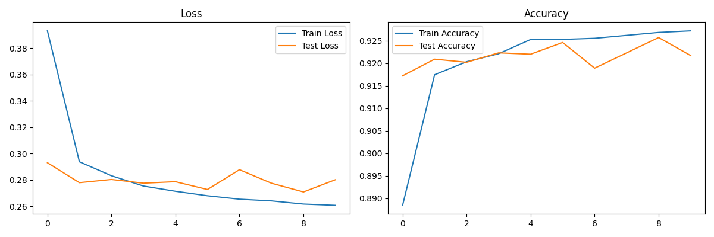
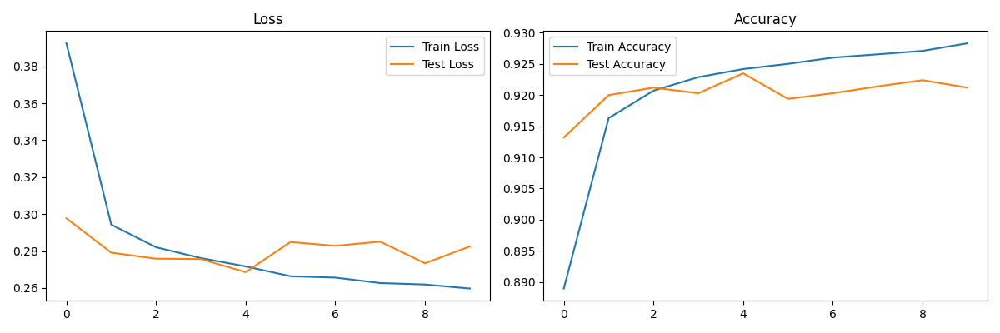
Модель с 2 слоями - время обучения: 107 секунд
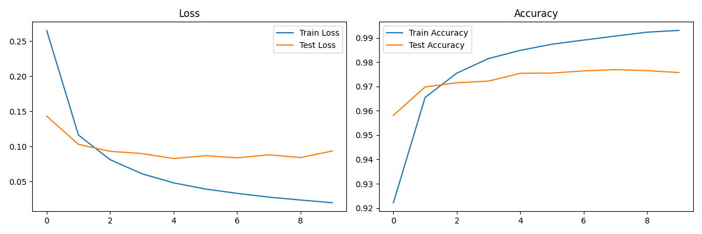
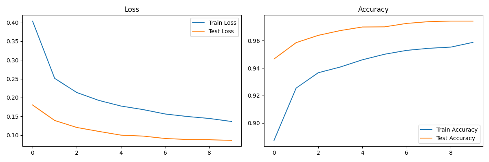
Модель с 3 слоями - время обучения: 110 секунд
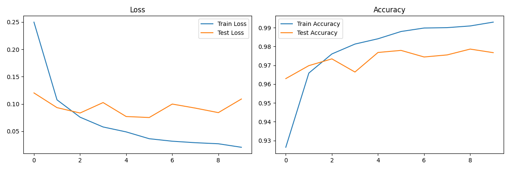
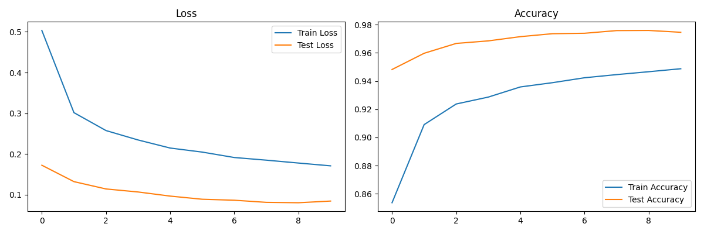
Модель с 5 слоями - время обучения: 115 секунд
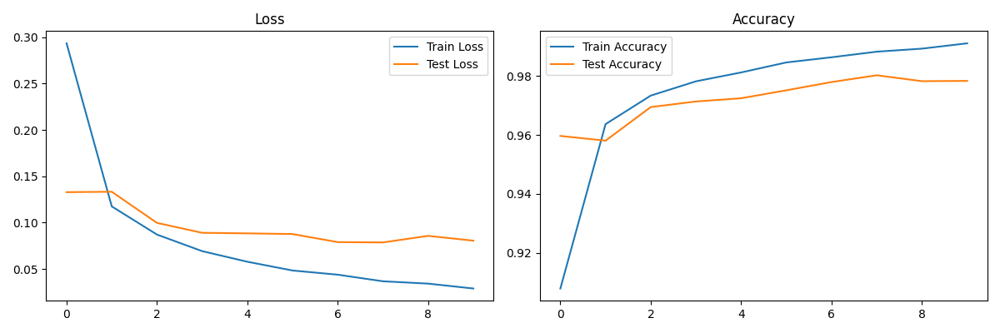
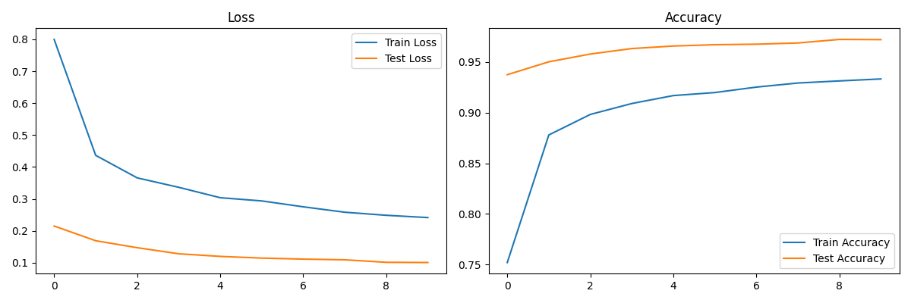
Модель с 7 слоями - время обучения: 122 секунды
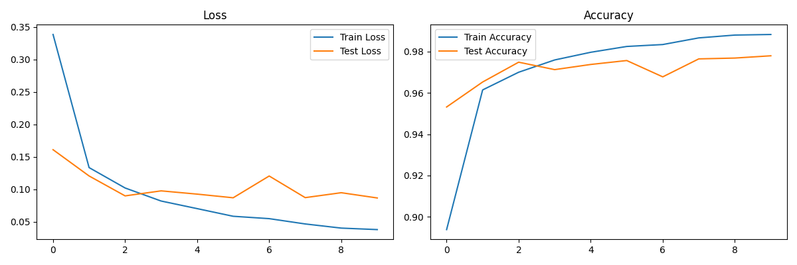
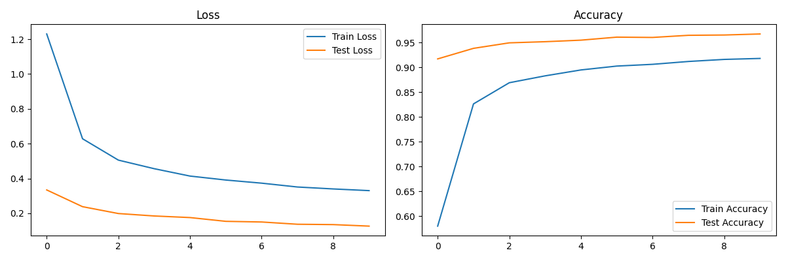

Можно сделать вывод, что увеличение глубины сети приводит к увеличению времени обучения, но не всегда к улучшению
качества.

При применении регуляризации и нормализации данных качество моделей увеличилось при небольшом увеличении времени,
тестовые результаты лучше чем тренировочные.

### 2.1 Сравнение моделей разной ширины

Узкие слои - время обучения: 109 секунд
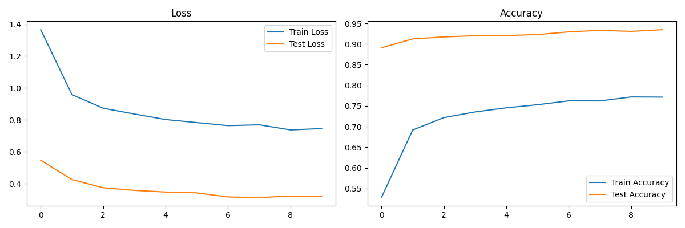

Средние слои - время обучения: 123 секунды
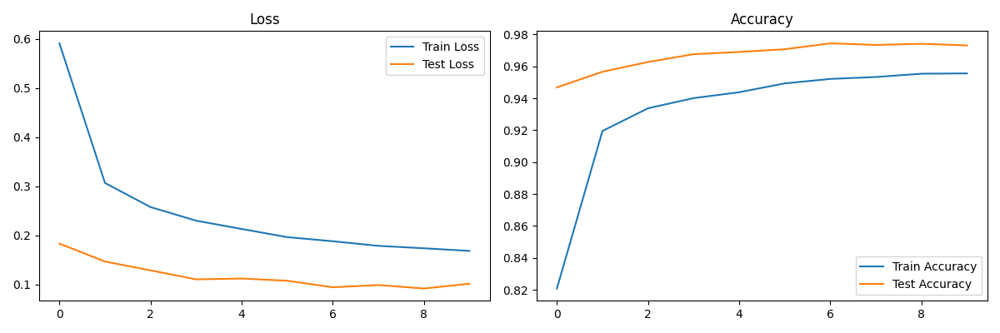

Широкие слои - время обучения: 116 секунд

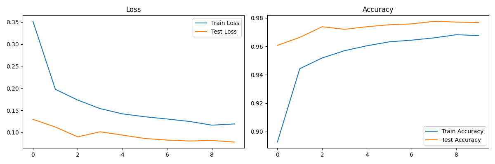

Очень широкие слои - время обучения: 128 секунд

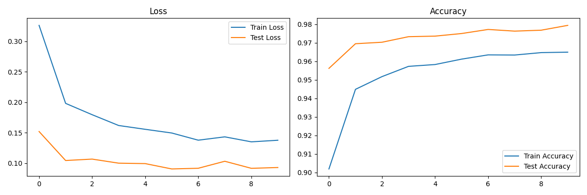

С увеличением ширины слоев время обучения увеличивается, но качество не всегда улучшается.

## Задание 3: Эксперименты с регуляризацией

Без регуляризации - время обучения: 121 секунда
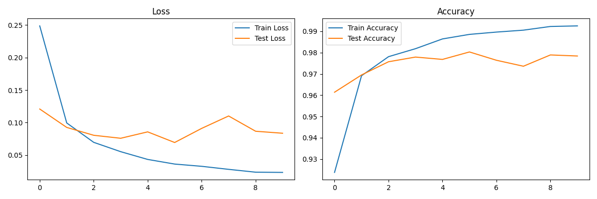

Dropout - время обучения: 130 секунд
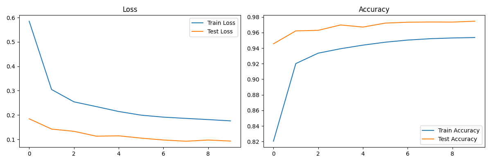

Batch Normalization - время обучения: 127 секунд
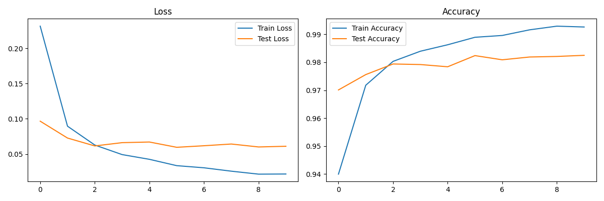

Dropout + Batch Normalization - время обучения: 130 секунд
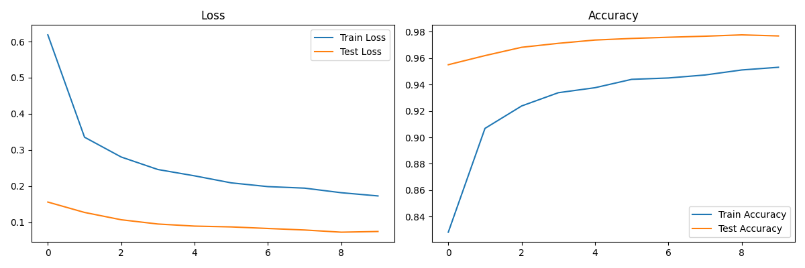

L2-регуляризация - время обучения: 126 секунд
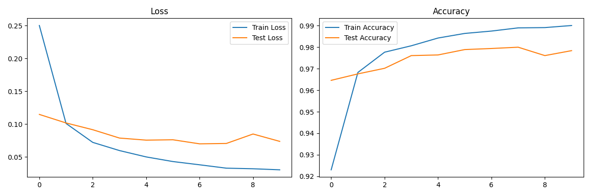

Dropout снижает переобучение, test accuracy стабильно высокая, но train accuracy не доходит до максимума.
Batch Normalization улучшает качество, но не всегда снижает переобучение.
Dropout в сочетании с Batch Normalization не дает значительного прироста.
L2-регуляризация также помогает снизить переобучение, но не всегда улучшает качество.